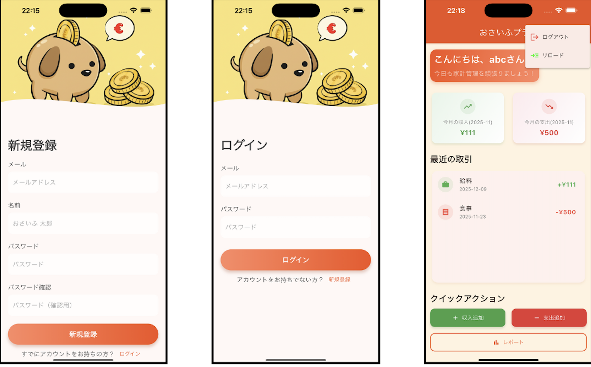

# OsaifuPlus Frontend

家計簿アプリ「OsaifuPlus」のフロントエンド（Flutter）プロジェクトです。

## 画面一覧



## 機能一覧

現在の実装状況に基づいた機能一覧です。

### 1️⃣ ユーザー認証
*   **ログイン／サインアップ**: メールアドレスとパスワードでアカウントを作成・ログインできます。
*   **ログアウト**: 安全にログアウトし、トークンを破棄します。

### 2️⃣ ホーム画面（ダッシュボード）
*   **今月の収支表示**: 今月の収入・支出の合計金額を一目で確認できます。
*   **最近の取引**: 直近の取引履歴をリスト表示します。
*   **クイックアクション**: ワンタップで「収入追加」「支出追加」ダイアログを開けます。

### 3️⃣ 取引管理
*   **追加**: 金額、カテゴリ、メモを入力して取引を記録します。
*   **編集**: 既存の取引内容（金額、カテゴリ、メモ）を修正できます。
*   **削除**: 不要な取引データを削除できます。

### 4️⃣ レポート（簡易版）
*   **月次履歴**: 過去の月ごとの収入・支出の合計を確認できます。

## 技術スタック

*   **Framework**: Flutter
*   **Language**: Dart
*   **State Management**: `setState` (Basic)
*   **Packages**:
    *   `http`: API通信
    *   `flutter_secure_storage`: JWTトークンの安全な保存
    *   `flutter_dotenv`: 環境変数管理 (.env)
    *   `intl`: 数値や日付のフォーマット

## 動かし方

### 1. 前提条件
*   Flutter SDK がインストールされていること
*   バックエンド (OsaifuPlus_be) が起動していること

### 2. 環境変数の設定
プロジェクトルートに `.env` ファイルを作成し、APIのURLを設定します。
※今回のアプリは学習用のため .env ファイルもコミットしていますが、本来はセキュリティの観点から .gitignore に含めるべきファイルです。

```env
# ローカル実行の例 (Android Emulatorの場合は 10.0.2.2)
BASE_API_URL=http://localhost:8080/api/v1
```

### 3. 依存関係のインストール
```bash
flutter pub get
```

### 4. アプリの起動
```bash
flutter run
```
